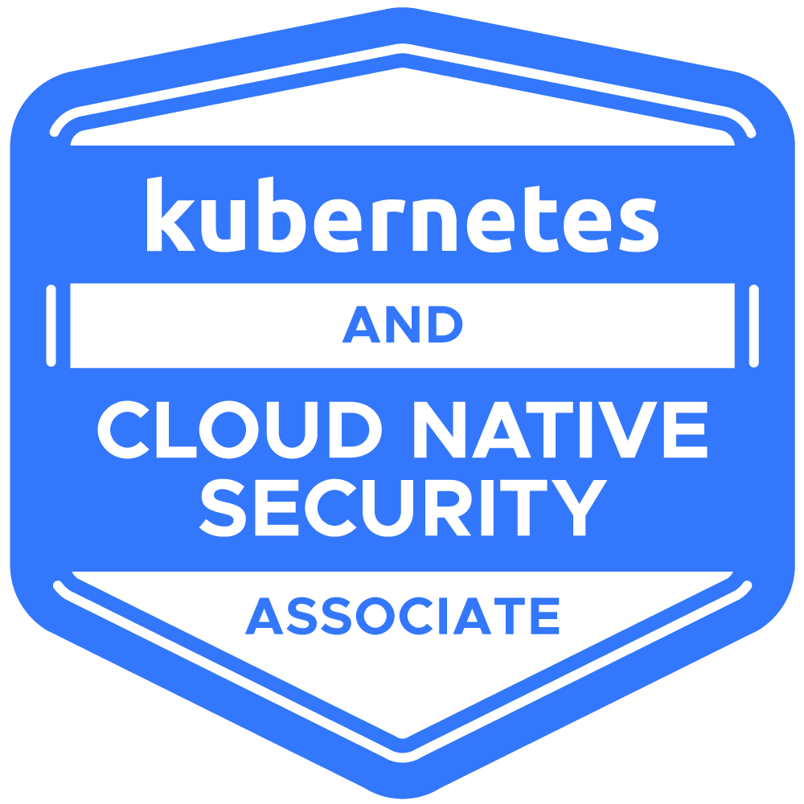

# Kubernetes and Cloud Native Security Associate (KCSA) in 2025

La certificación **Kubernetes and Cloud Native Security Associate (KCSA)** se centra en los aspectos de seguridad de Kubernetes y los entornos nativos de la nube. En 2024, está ganando relevancia debido a que asegurar la infraestructura en la nube, especialmente las aplicaciones en contenedores, se está volviendo crucial por la creciente adopción de Kubernetes en diversas industrias.

  

# Certification

- Detalles del Examen: **90 minutos**.
- Número de preguntas: **60 preguntas de opción múltiple**.
- Puntuación mínima para aprobar : **75%** o superior .
- Validez de la certificación : **2 años** .
- Costo del examen : **$250 USD** .
- Elegibilidad para el examen : **12 meses** , con un reintento gratuito dentro de este período.
- [The official website with certification](https://training.linuxfoundation.org/certification/kubernetes-and-cloud-native-security-associate-kcsa/)
- [CNCF Exam Curriculum repository](https://github.com/cncf/curriculum/)
- [Tips & Important Instructions: KCSA](https://docs.linuxfoundation.org/tc-docs/certification/important-instructions-mc)
- [Candidate Handbook](https://docs.linuxfoundation.org/tc-docs/certification/lf-handbook2)
- [Verify Certification](https://training.linuxfoundation.org/certification/verify/)

# Estructura de certificación

## Índice

1. [Lecciones Clave](#lecciones-clave)
   - [Lesson 1: Overview of Cloud Native Security - 14%](#overview-of-cloud-native-security)
   - [Lesson 2: Kubernetes Cluster Component Security - 22%](#kubernetes-cluster-component-security)
   - [Lesson 3: Kubernetes Security Fundamentals - 22%](#kubernetes-security-fundamentals)
   - [Lesson 4: Kubernetes Threat Model - 16%](#kubernetes-threat-model)
   - [Lesson 5: Platform Security - 16%](#platform-security)
   - [Lesson 6: Compliance and Security Frameworks - 10%](#compliance-and-security-frameworks)
2. [Conclusiones](#conclusiones)
3. [Recursos Adicionales](#recursos-adicionales) 
4. [Como registrarse](#como-registrarse) 

## Lesson 1: 

## Overview of Cloud Native Security

[Cloud Native Security and Kubernetes](https://kubernetes.io/docs/concepts/security/cloud-native-security/)

El lección se centra en la importancia de la seguridad cloud-native, enfatizando los cuatro componentes críticos: Cloud, Clusters, Containers y Code. Destaca cómo cada elemento contribuye a un entorno cloud seguro mediante la implementación de mejores prácticas y herramientas. Comenzando con la infraestructura cloud, se deben aplicar medidas de seguridad para proteger los servicios proporcionados por los proveedores cloud. Los Clusters, particularmente aquellos orquestados por Kubernetes, requieren configuraciones seguras para evitar vulnerabilidades. Los Containers, que sirven como entorno de ejecución, necesitan prácticas de seguridad estrictas para salvaguardar la ejecución de aplicaciones. Por último, el Code forma la base de las aplicaciones y debe desarrollarse con consideraciones de seguridad desde el principio. El lección aboga por un enfoque de seguridad holístico, conocido como defense-in-depth, integrando varias medidas de seguridad como identity and access management (IAM), encriptación de datos y auditorías regulares de vulnerabilidades. Además, discute la importancia de los marcos de compliance como CIS benchmarks y las directrices NIST para reforzar las mejores prácticas de seguridad. Técnicas como el aislamiento, el escaneo de vulnerabilidades durante el pipeline CI/CD y las pruebas automatizadas se enfatizan como esenciales para mantener los límites de seguridad y prevenir brechas. El mensaje general es que asegurar aplicaciones cloud-native requiere una estrategia integral que aborde cada capa de la arquitectura.

### Aspectos destacados
- ☁️ **Cloud Security**: Asegurar que la infraestructura y los servicios proporcionados por los proveedores cloud es primordial.
- 🗂️ **Cluster Configuration**: Las plataformas de orquestación como Kubernetes deben configurarse de manera segura para minimizar vulnerabilidades.
- 🛡️ **Container Security Practices**: Se deben aplicar medidas estrictas de seguridad a los entornos de ejecución para proteger las aplicaciones.
- 📜 **Code Integrity**: Desarrollar código fundacional con la seguridad en mente es crucial para la protección de las aplicaciones.
- 🔐 **Identity and Access Management (IAM)**: Implementar roles y políticas IAM es clave para reducir la superficie de ataque.
- 🔍 **Vulnerability Audits**: Las auditorías regulares de infraestructura ayudan a identificar y mitigar potenciales riesgos de seguridad.
- 📊 **Compliance Frameworks**: Utilizar controles de seguridad y frameworks como CIS benchmarks y directrices NIST ayuda a las organizaciones a adherirse a las mejores prácticas.

### Ideas clave

#### ☁️ Holistic Security Approach
El concepto de defense-in-depth es esencial en la seguridad cloud-native, abordando vulnerabilidades en múltiples capas. Al asegurar que cada una de las cuatro C (Cloud, Clusters, Containers y Code) esté protegida, las organizaciones pueden crear una postura de seguridad robusta que reduzca efectivamente los riesgos. Este enfoque por capas ayuda no solo a prevenir brechas, sino también a responder rápidamente a incidentes si ocurrieran.

#### 🗂️ Importance of Cluster Security
Configurar clusters Kubernetes de manera segura es crítico, ya que las configuraciones incorrectas pueden llevar a vulnerabilidades significativas. Adoptar mejores prácticas para la seguridad de clusters, como implementar role-based access control (RBAC) y asegurar etcd (el almacén de valores clave para Kubernetes), puede prevenir accesos no autorizados y brechas de datos.

#### 🛡️ Container Vulnerability Management
Los Containers, siendo entornos de ejecución para aplicaciones, deben ser monitoreados continuamente para detectar vulnerabilidades. Herramientas como Clair o Trivy pueden automatizar el escaneo de imágenes de contenedores para detectar vulnerabilidades conocidas durante el pipeline CI/CD, asegurando que solo se implementen imágenes seguras. Este enfoque proactivo minimiza el riesgo de introducir vulnerabilidades en entornos de producción.

#### 📜 Code Security Practices
La seguridad debe integrarse en el ciclo de vida del desarrollo, comenzando a nivel de código. Técnicas como el análisis estático y dinámico de código pueden ayudar a identificar vulnerabilidades temprano en el proceso de desarrollo. El uso de herramientas como SonarQube no solo mejora la calidad del código sino que también asegura que los fallos de seguridad se aborden antes de la implementación.

#### 🔐 Role of IAM in Security
La implementación efectiva de roles y políticas Identity and Access Management (IAM) es crucial para controlar el acceso a los recursos cloud. Al otorgar acceso con privilegios mínimos, las organizaciones pueden reducir significativamente su superficie de ataque, limitando así las posibles rutas de explotación para los atacantes.

#### 🔍 Continuous Vulnerability Audits
Las auditorías regulares y evaluaciones de vulnerabilidades son esenciales para mantener un entorno cloud seguro. Las organizaciones deben adoptar un enfoque proactivo hacia la seguridad, monitoreando continuamente su infraestructura en busca de nuevas vulnerabilidades y abordándolas prontamente.

#### 📊 Adherence to Compliance Standards
Utilizar frameworks como CIS benchmarks y directrices NIST proporciona a las organizaciones una hoja de ruta estructurada para la compliance de seguridad. Estos frameworks abarcan varios aspectos de seguridad, desde configuraciones de red hasta estándares de encriptación, asegurando que las mejores prácticas se apliquen consistentemente en toda la organización.

### En conclusión
La lección enfatiza que asegurar aplicaciones nativas de la nube requiere una estrategia multifacética que integre diversas prácticas y herramientas de seguridad en toda la infraestructura de la nube, plataformas de orquestación, entornos de contenedores y bases de código. Al abordar cada capa de seguridad y adoptar una postura proactiva frente a vulnerabilidades y cumplimiento (**compliance**), las organizaciones pueden mejorar significativamente su postura de seguridad y protegerse contra posibles amenazas.

## Lesson 2: 

## Kubernetes Cluster Component Security

[Pod Security Standards](https://kubernetes.io/docs/concepts/security/pod-security-standards/)

[Authentication in an Kubernetes cluster](https://kubernetes.io/docs/reference/access-authn-authz/authentication/)

[Authorization overview in an Kubernetes cluster](https://kubernetes.io/docs/reference/access-authn-authz/authorization/)

"Kubernetes & Cloud Native Security Associate Exam Full Course - Lesson Cluster Component Security" profundiza en los componentes y prácticas de seguridad esenciales para proteger un cluster Kubernetes. Enfatiza la importancia del API server como entidad central de gestión que procesa operaciones RESTful y facilita la comunicación entre varios componentes del cluster. Se destacan medidas clave de seguridad, incluyendo la implementación de encriptación TLS para el tráfico API, role-based Access Control (RBAC) para limitar permisos, y estrategias para gestionar la integridad y confidencialidad de datos. El lección además explora los roles de varios componentes como el controller manager, scheduler y kubelet, y discute cómo interactúan dentro del cluster mientras garantizan la seguridad. Adicionalmente, aborda la importancia de la seguridad del container runtime, pod security, network policies y encriptación de almacenamiento de datos, proporcionando una visión integral de las mejores prácticas para asegurar un entorno Kubernetes.

### Aspectos destacados
- 🔒 **Central Management**: El API server actúa como la entidad central de gestión para manejar operaciones RESTful y permitir la comunicación entre componentes del cluster.
- 🔐 **TLS Encryption**: La seguridad se mejora mediante encriptación TLS para todo el tráfico API, asegurando integridad y confidencialidad de datos.
- ⚙️ **Controller Manager**: Supervisa los bucles de control que regulan el estado del cluster, incluyendo la gestión de nodes y operaciones de jobs con énfasis en asegurar el acceso mediante RBAC.
- 📦 **Efficient Scheduling**: El scheduler optimiza la colocación de pods en nodes basándose en la disponibilidad de recursos, requiriendo operaciones seguras y fuentes de entrada confiables.
- 🛡️ **Container Lifecycle Management**: Kubelet interactúa con el container runtime para gestionar el ciclo de vida de los containers, enfatizando la comunicación segura y el acceso a nodes.
- 🌐 **Network Communication**: Kube proxy gestiona la comunicación de red dentro del cluster, donde asegurar las interfaces de red y aplicar políticas es vital.
- 🔑 **Data Security**: Garantizar la seguridad de datos en reposo y en tránsito implica encriptar información sensible e implementar controles de acceso estrictos.

### Ideas clave

#### 🌟 API Server Security Practices
El API server es la piedra angular de la operación de Kubernetes, y asegurarlo requiere un enfoque multicapa. Implementar TLS para todas las comunicaciones no solo protege los datos en tránsito sino que también ayuda a prevenir accesos no autorizados y posible intercepción de información sensible. Al restringir el acceso API a través de RBAC, las organizaciones pueden asegurar que solo personal autorizado pueda realizar operaciones específicas, reduciendo significativamente el riesgo de brechas de seguridad.

#### 🔑 Role of the Controller Manager
El controller manager es vital para mantener el estado deseado del cluster. A través de sus bucles de control, gestiona operaciones esenciales como la administración de nodes y programación de jobs. Asegurar el controller manager implica configurar RBAC para limitar permisos, minimizando así el riesgo de control no autorizado y asegurando que solo entidades confiables puedan influir en el estado del cluster.

#### 📊 Scheduler Optimization
El scheduler juega un papel crucial en la optimización de la asignación de recursos al determinar los nodes más adecuados para pods no asignados. La seguridad para el scheduler es primordial e implica aislamiento y controles de acceso adecuados.

## Lesson 3: 

## Kubernetes Security Fundamentals

[OWASP Kubernetes Top 10](https://owasp.org/www-project-kubernetes-top-ten/)

En el "Kubernetes & Cloud Native Security Associate Exam Course - Lesson Kubernetes Security Fundamentals", el enfoque está en el marco integral de seguridad proporcionado por Kubernetes para gestionar sus pods. La lección describe los Pod Security Standards, que categorizan la seguridad de pods en tres perfiles—Baseline, Restricted y Privileged—cada uno diseñado para guiar la postura de seguridad desde la menos hasta la más restrictiva. Por ejemplo, aplicaciones en sectores sensibles como finanzas pueden emplear el perfil Restricted para imponer medidas rigurosas de seguridad, minimizando efectivamente las posibles superficies de ataque.

El Pod Security Admission (PSA) controller juega un papel crucial, actuando como un guardián para hacer cumplir estos perfiles de seguridad durante la creación y modificación de pods. Además, la lección enfatiza la importancia de la autenticación y autorización dentro de Kubernetes. Detalla los métodos para asegurar el acceso, como el uso de certificados, tokens e integración con proveedores externos, destacando la necesidad del principio de privilegio mínimo a través de role-based access control (RBAC).

La gestión de secrets es otro aspecto fundamental discutido, donde información sensible como contraseñas y tokens debe almacenarse de forma segura para prevenir brechas. La lección enfatiza la necesidad de encriptación, RBAC para limitar el acceso y evitar secrets codificados en el código. Además, destaca la importancia del aislamiento y segmentación a través de namespaces de Kubernetes y network policies, que ayudan a prevenir accesos no autorizados y limitar el impacto de posibles brechas.

El audit logging se presenta como una práctica crítica para rastrear actividades de usuarios y sistemas, ayudando en el análisis de seguridad y monitoreo de compliance. Al implementar políticas de auditoría integrales, las organizaciones pueden capturar eventos y cambios esenciales, lo cual es crucial para mantener la integridad de seguridad. Por último, la lección subraya la necesidad de network policies granulares para gestionar eficazmente la comunicación entre pods, mejorando así la seguridad al restringir flujos de tráfico y reducir el riesgo de amenazas internas.

### Aspectos destacados
- 🔒 **Pod Security Standards** guían la seguridad de pods de Kubernetes a través de tres perfiles: Baseline, Restricted y Privileged.
- 🚪 **Pod Security Admission (PSA) Controller** actúa como guardián para imponer el cumplimiento de perfiles de seguridad durante la creación y modificación de pods.
- 🛡️ **Authentication Methods** incluyen certificados, tokens e integración con proveedores externos para la identificación segura de usuarios y servicios.
- 🗝️ **Role-Based Access Control (RBAC)** asegura una gestión estricta de permisos, enfatizando el principio de privilegio mínimo.
- 🔑 **Secrets Management** es crítico para manejar datos sensibles de forma segura, involucrando encriptación y controles de acceso a través de RBAC.
- 🌐 **Network Policies** definen reglas de comunicación entre pods, facilitando un modelo de confianza cero para prevenir accesos no autorizados.
- 📜 **Audit Logging** rastrea actividades de usuarios y sistemas, esencial para análisis de seguridad y esfuerzos de compliance.

### Ideas clave

#### 🔒 Pod Security Standards son esenciales para definir posturas de seguridad
Los tres perfiles—Baseline, Restricted y Privileged—permiten a las organizaciones elegir un nivel apropiado de seguridad basado en sus necesidades específicas. Por ejemplo, una aplicación financiera podría necesitar controles estrictos para reducir vulnerabilidades, mostrando cómo medidas de seguridad adaptadas pueden mitigar riesgos efectivamente.

#### 🚪 El PSA Controller mejora la aplicación de seguridad
Al actuar en el punto de creación y modificación de pods, el PSA controller asegura que solo se implementen pods conformes. Esta medida proactiva reduce significativamente la probabilidad de introducir vulnerabilidades en el entorno.

#### 🛡️ Mecanismos robustos de autenticación son cruciales para asegurar el acceso
El uso de diversos métodos, incluyendo tokens para acceso temporal y certificados para comunicación entre máquinas, refuerza el marco de seguridad. Las organizaciones pueden aprovechar service accounts con permisos limitados para tareas automatizadas, asegurando que usuarios y servicios solo tengan acceso necesario para sus roles.

#### 🗝️ RBAC permite un control granular de permisos
A través de RBAC, las organizaciones pueden definir roles y permisos específicos, gestionando el acceso estrictamente. Este enfoque estructurado no solo mejora la seguridad sino que también simplifica la auditoría de derechos de acceso, asegurando el cumplimiento de políticas de seguridad.

#### 🔑 La gestión de secrets es vital para salvaguardar información sensible
El manejo adecuado de secrets—como encriptarlos en reposo y usar RBAC para limitar el acceso—previene la exposición no autorizada. Por ejemplo, utilizar secrets para inyectar credenciales de base de datos en tiempo de ejecución mantiene los datos sensibles fuera del código fuente, reforzando la seguridad.

#### 🌐 Network policies son clave para implementar un modelo de seguridad de confianza cero
Al definir cómo se comunican los pods, las organizaciones pueden restringir efectivamente los flujos de tráfico, minimizando así el riesgo de movimiento lateral por potenciales amenazas. Este control granular es esencial en entornos con interacciones complejas entre servicios.

#### 📜 Audit logging proporciona visibilidad y responsabilidad
Rastrear acciones de usuarios y eventos del sistema es crucial para identificar comportamientos sospechosos y asegurar el cumplimiento de estándares de seguridad. Los logs de auditoría integrales sirven como un recurso valioso para análisis de seguridad, ayudando a las organizaciones a responder a incidentes y mejorar su postura de seguridad con el tiempo.

### En conclusión
La lección sobre los Fundamentos de Seguridad de Kubernetes enfatiza la necesidad de un enfoque integral y en capas para la seguridad dentro de los entornos de Kubernetes. Al comprender e implementar las normas y prácticas de seguridad descritas, las organizaciones pueden mejorar significativamente su postura de seguridad, proteger datos sensibles y mitigar los riesgos asociados con el despliegue de aplicaciones nativas de la nube.

## Lesson 4:

## Kubernetes Threat Model

[STRIDE threat model](https://dev.to/pbnj/demystifying-stride-threat-models-230m)

El lección discute los aspectos críticos de la seguridad de Kubernetes, centrándose en la definición de límites de confianza, persistencia de datos, ataques de denegación de servicio (DoS), ejecución de código malicioso, amenazas de red, control de acceso y escalado de privilegios. Enfatiza la importancia de comprender los perímetros de seguridad dentro de los clusters de Kubernetes, particularmente cómo se gestionan la comunicación interna y el flujo de datos externos. Las ideas compartidas en el lección proporcionan una visión integral de las vulnerabilidades potenciales y desafíos que las organizaciones pueden enfrentar al implementar Kubernetes en producción. Medidas de seguridad clave, como implementar cuotas de recursos, usar herramientas de escaneo de containers y aplicar un estricto role-based access control (RBAC), se destacan como prácticas esenciales para mitigar riesgos y garantizar la integridad y disponibilidad de aplicaciones y datos dentro de entornos Kubernetes.

### Aspectos destacados
- 🔒 **Understanding Trust Boundaries**: Definir el perímetro de seguridad alrededor de los componentes del cluster y el flujo de datos es crítico para aislar recursos y proteger datos sensibles.
- 📦 **Data Persistence Challenges**: Gestionar el almacenamiento de datos más allá del ciclo de vida de los pods, especialmente para aplicaciones con estado como bases de datos, es esencial para mantener la integridad y disponibilidad de datos.
- 🚫 **Denial of Service Risks**: Los atacantes pueden explotar límites de recursos no regulados para sobrecargar los recursos del cluster, lo que hace necesaria la implementación de cuotas de recursos y monitoreo.
- 🛡️ **Malicious Code Execution Threats**: Las vulnerabilidades en aplicaciones pueden permitir a los atacantes ejecutar código arbitrario, destacando la necesidad de escaneo de containers y el principio de privilegio mínimo.
- 🔒 **Network-Level Threats**: Los ataques man-in-the-middle pueden comprometer datos en tránsito; por lo tanto, encriptar el tráfico de red y controlar la comunicación entre pods es vital.
- 🔑 **Access Control Vulnerabilities**: Un RBAC inadecuado puede llevar a acceso no autorizado a datos, haciendo crucial usar Kubernetes secrets de forma segura e implementar políticas de acceso estrictas.
- ⚠️ **Privilege Escalation Risks**: Explotar vulnerabilidades para obtener acceso no autorizado puede mitigarse asegurando privilegios mínimos y auditando regularmente las configuraciones del cluster.

### Ideas clave

#### 🔒 En Kubernetes, los trust boundaries definen el perímetro de seguridad alrededor de los componentes del cluster
Comprender cómo los límites de confianza internos, como la comunicación de un pod con el API server, permiten el aislamiento de recursos es fundamental. Los trust boundaries aseguran que solo componentes autorizados se comuniquen entre sí, protegiendo datos sensibles y manteniendo la integridad de las operaciones del cluster.

#### 📦 La persistencia de datos es un desafío complejo
Asegurar que los datos permanezcan accesibles e intactos más allá del ciclo de vida de pods individuales es crucial, especialmente para aplicaciones con estado como bases de datos. El uso de persistent volumes debe configurarse cuidadosamente para mitigar riesgos asociados con pérdida de datos o acceso no autorizado.

#### 🚫 Los ataques de Denial of Service representan amenazas significativas
Los atacantes pueden explotar límites de recursos no regulados para agotar recursos computacionales, dejando servicios no disponibles. Es esencial implementar cuotas y límites de recursos de manera proactiva para gestionar la asignación de recursos dentro del cluster.

#### 🛡️ La ejecución de código malicioso puede llevar a brechas severas
El riesgo de que atacantes exploten vulnerabilidades de aplicaciones para ejecutar código arbitrario dentro de containers es una preocupación significativa. Emplear herramientas de escaneo de containers ayuda a las organizaciones a detectar vulnerabilidades temprano en el ciclo de desarrollo.

#### 🔒 Las amenazas a nivel de red requieren defensas robustas
Los atacantes pueden interceptar o manipular datos durante la transmisión, llevando a implicaciones severas de seguridad. Por ejemplo, los ataques man-in-the-middle (MITM) pueden comprometer la integridad de los datos en tránsito. Por lo tanto, encriptar el tráfico de red usando Transport Layer Security (TLS) es crítico para proteger datos sensibles.

#### 🔑 El acceso a datos sensibles debe ser estrictamente controlado
Un role-based access control (RBAC) inadecuado puede resultar en acceso no autorizado a información sensible. Usar Kubernetes secrets para almacenar datos sensibles, junto con encriptar datos tanto en reposo como en tránsito, es vital para mantener la confidencialidad.

#### ⚠️ El escalado de privilegios presenta un riesgo significativo
Los atacantes pueden explotar vulnerabilidades dentro del cluster para obtener acceso o capacidades no autorizadas, como implementar un pod mal configurado para lograr acceso root. Para mitigar estos riesgos, las organizaciones deberían asegurar que los pods se ejecuten con privilegios mínimos y utilizar security contexts para restringir sus capacidades. La auditoría regular de configuraciones del cluster puede prevenir aún más oportunidades para escalado de privilegios, salvaguardando la integridad y seguridad del cluster.

### En conclusión
La lección ofrece un análisis exhaustivo de los diversos desafíos y consideraciones de seguridad dentro de los entornos de Kubernetes. Subraya la importancia de comprender los límites de confianza (**trust boundaries**), gestionar la persistencia de datos, prevenir ataques de denegación de servicio (**DoS**), mitigar los riesgos de ejecución de código malicioso, asegurar las comunicaciones de red, aplicar controles de acceso y gestionar las amenazas de escalada de privilegios (**privilege escalation**). Al adoptar prácticas de seguridad robustas, las organizaciones pueden mejorar significativamente la seguridad de sus implementaciones de Kubernetes y proteger los datos sensibles de posibles vulnerabilidades y ataques.

## Lesson 5:

## Platform Security

[Kubernetes Security Cheat Sheet](https://cheatsheetseries.owasp.org/cheatsheets/Kubernetes_Security_Cheat_Sheet.html)

[Securing a Cluster](https://kubernetes.io/docs/tasks/administer-cluster/securing-a-cluster/)

El lección titulado "Kubernetes & Cloud Native Security Associate Exam Course - Lesson Platform Security" profundiza en las complejidades de la seguridad de la cadena de suministro en ecosistemas cloud-native, enfatizando la importancia de mantener la integridad y seguridad a lo largo del ciclo de vida del software—desde el desarrollo hasta la implementación. Una brecha en la cadena de suministro puede exponer sistemas a vulnerabilidades generalizadas, como lo ilustra el hack de SolarWinds, que destacó los peligros de insertar código malicioso en actualizaciones legítimas de software. La discusión subraya la necesidad de verificar código de terceros y aprovechar herramientas como Sigstore para la firma de artefactos y registros de transparencia para crear una cadena de suministro de software segura.

El lección también cubre el papel crítico de los image repositories en los pipelines de implementación, abogando por el uso de registros privados para imágenes sensibles, la implementación de firma de imágenes para autenticidad, y escaneos regulares de vulnerabilidades para garantizar la seguridad. Por ejemplo, la característica Content Trust de Docker asegura que las imágenes estén firmadas, verificando su origen e integridad antes de la implementación.

Además, se explora el concepto de observability, enfatizando la importancia del monitoreo, logging y tracing para obtener insights sobre la salud y rendimiento de aplicaciones e infraestructura. Una observability mejorada ayuda a detectar anomalías e incidentes potenciales de seguridad. Se proporcionan aplicaciones del mundo real, como monitorear clusters Kubernetes usando Prometheus y Fluent, como ejemplos de sistemas de alerta temprana para problemas de seguridad.

La lección también discute service meshes, específicamente Istio, que ofrece una capa de infraestructura dedicada para gestionar la comunicación de servicios. Proporciona características como identidad segura de servicio, tráfico encriptado y control de acceso granular. El caso de uso práctico de Istio se destaca, mostrando su capacidad para encriptar automáticamente el tráfico entre servicios para mitigar el riesgo de intercepción de datos.

La Public Key Infrastructure (PKI) se presenta como un elemento fundamental para la comunicación electrónica segura en actividades de red, incluyendo email, comercio electrónico y banca por internet. Abarca los roles, políticas, hardware, software y procedimientos necesarios para crear, gestionar, distribuir, usar, almacenar y revocar certificados digitales. Dentro de Kubernetes, PKI sustenta la seguridad del cluster facilitando la comunicación segura entre componentes y usuarios a través de la gestión de certificados TLS para encriptación y autenticación.

La conectividad en Kubernetes se enfatiza como un aspecto crítico que requiere medidas de seguridad robustas para prevenir acceso no autorizado y brechas de datos. El uso de network policies para restringir comunicaciones y TLS para encriptar datos en tránsito se destacan como prácticas esenciales de seguridad. Un ejemplo incluye la restricción de comunicaciones de pods a través de network policies, permitiendo solo conexiones necesarias para minimizar la superficie de ataque.

Finalmente, se discuten los admission controllers en Kubernetes como guardianes que imponen políticas antes de que los objetos sean admitidos en el cluster. Estos controllers son cruciales para la seguridad, permitiendo a los administradores definir e imponer estándares de compliance y seguridad de manera efectiva.

### Aspectos destacados
- 🔐 **Supply Chain Security**: Enfatiza la necesidad crítica de asegurar la cadena de suministro de software para prevenir vulnerabilidades.
- 🛡️ **Real-World Example**: El hack de SolarWinds ilustra los peligros de las actualizaciones de software comprometidas.
- 📦 **Image Repositories**: Discute la importancia de asegurar image repositories y usar registros privados.
- 🔍 **Enhanced Observability**: Destaca el papel del monitoreo y logging en la detección de incidentes de seguridad.
- 🔗 **Service Meshes**: Introduce Istio como medio para gestionar la comunicación de servicios de manera segura dentro de clusters.
- 🔑 **PKI in Kubernetes**: Explica el papel de PKI en facilitar comunicaciones seguras y gestionar certificados TLS.
- ⚙️ **Admission Controllers**: Discute cómo los admission controllers imponen políticas de seguridad y compliance en Kubernetes.

### Ideas clave

#### 🔍 Supply Chain Vulnerabilities
El lección destaca que las brechas en la cadena de suministro de software pueden tener efectos catastróficos, como demuestra el ataque a SolarWinds. Las organizaciones deben priorizar la verificación de código y utilizar herramientas como Sigstore para aumentar la transparencia y seguridad.

#### 🛡️ Importance of Image Security
Asegurar image repositories es vital para mantener la integridad de las implementaciones de software. El uso de registros privados y firma de imágenes ayuda a garantizar que solo se implementen imágenes autenticadas y verificadas, reduciendo el riesgo de introducir vulnerabilidades.

#### 📈 Role of Observability
La observability mejorada a través de monitoreo y logging es esencial para identificar proactivamente amenazas de seguridad. Herramientas como Prometheus y Fluent proporcionan métricas y logs valiosos, permitiendo a las organizaciones responder rápidamente a problemas potenciales.

#### 🔗 Service Mesh Advantages
Istio proporciona un framework robusto para gestionar la comunicación servicio a servicio en entornos Kubernetes. Sus capacidades para encriptar tráfico y aplicar controles de acceso ayudan a mitigar riesgos asociados con la intercepción de datos.

#### 🔑 PKI's Critical Role
Public Key Infrastructure es fundamental para comunicaciones seguras en Kubernetes. Asegura que los datos sensibles estén encriptados y que usuarios y componentes puedan autenticarse mutuamente, manteniendo así la integridad general del sistema.

#### 🔒 Connectivity Security
El lección enfatiza que medidas de seguridad robustas para la conectividad, como TLS y network policies, son primordiales para prevenir acceso no autorizado. Estas estrategias ayudan a limitar la superficie de ataque y salvaguardar datos sensibles.

#### ⚖️ Compliance through Admission Controllers
Los admission controllers sirven como guardianes esenciales en Kubernetes, permitiendo a los administradores imponer políticas de seguridad. Esta aplicación es crítica para mantener estándares de compliance y proteger el cluster de actividades maliciosas.

### En conclusión
La lección sirve como una visión general completa de la seguridad de la plataforma dentro de los ecosistemas nativos de la nube, centrándose particularmente en Kubernetes. Al comprender los diversos componentes y estrategias para proteger estos entornos, las organizaciones pueden protegerse mejor contra las amenazas en constante evolución en el panorama digital. Los conocimientos y aspectos destacados presentados refuerzan la necesidad de un enfoque proactivo para la seguridad, abarcando todo, desde la gestión de la cadena de suministro hasta la observabilidad (**observability**) y el cumplimiento (**compliance**).

## Lesson 6:

## Compliance and Security Frameworks

[Kubernetes Hardening Guide by NSA and CISA](https://www.cisa.gov/news-events/alerts/2022/03/15/updated-kubernetes-hardening-guide) [PDF](https://media.defense.gov/2022/Aug/29/2003066362/-1/-1/0/CTR_KUBERNETES_HARDENING_GUIDANCE_1.2_20220829.PDF)

[Security Strategies for Microservices-based Application Systems by NIST](https://csrc.nist.gov/pubs/sp/800/204/final) [PDF](https://nvlpubs.nist.gov/nistpubs/SpecialPublications/NIST.SP.800-204.pdf)

En el ámbito de los ecosistemas cloud-native, los compliance frameworks sirven como estándares esenciales que guían a las organizaciones en el cumplimiento de requisitos estrictos de seguridad y privacidad. Esta lección en lección se centra en varios compliance frameworks y su relevancia para la seguridad de Kubernetes. Los Center for Internet Security (CIS) benchmarks para Kubernetes proporcionan recomendaciones detalladas destinadas a asegurar clusters mediante la minimización de vulnerabilidades. De manera similar, la directiva NIS (Network and Information Systems) ofrece pautas integrales que, aunque inicialmente diseñadas para sistemas federales, han ganado tracción en la industria debido a su exhaustividad. El General Data Protection Regulation (GDPR) enfatiza la importancia de la protección y privacidad de datos, abordando específicamente cómo se gestionan los datos dentro de implementaciones Kubernetes, destacando aspectos críticos como encriptación de datos, control de acceso y capacidades de auditoría.

Para garantizar una postura de seguridad robusta y compliance, las organizaciones deben implementar estos frameworks de manera efectiva. El threat modeling se introduce como un enfoque estructurado para identificar y mitigar potenciales amenazas de seguridad. Frameworks como STRIDE (Spoofing, Tampering, Repudiation, Information Disclosure, Denial of Service, y Elevation of Privileges) proporcionan un método sistemático para analizar la seguridad de aplicaciones e infraestructura. Además, la metodología PASTA (Process for Attack Simulation and Threat Analysis) se centra en una evaluación basada en riesgos de amenazas de seguridad dentro de entornos Kubernetes.

La supply chain compliance es cada vez más vital con la creciente dependencia de componentes open-source y herramientas de terceros. El riesgo de ataques a la cadena de suministro necesita medidas como usar imágenes base confiables, firmar imágenes y realizar escaneos de vulnerabilidades. Herramientas como CLA para escanear vulnerabilidades y Notary para firmar imágenes ejemplifican cómo imponer compliance en la cadena de suministro, asegurando que solo se implementen componentes seguros y verificados.

La automatización y las herramientas de seguridad desempeñan un papel crítico en el mantenimiento del cumplimiento dentro de los entornos rápidos de Kubernetes. Las verificaciones automatizadas de cumplimiento, los escaneos de seguridad y la aplicación de políticas ayudan a mitigar errores humanos y garantizar un cumplimiento continuo. Herramientas como **Kerno** y **Open Policy Agent (OPA)** facilitan un enfoque de política como código (**policy-as-code**), permitiendo la automatización de la aplicación de políticas de seguridad. Las aplicaciones del mundo real incluyen el uso de **Kyero** para implementar automáticamente recomendaciones del **CIS Benchmark**, como restringir contenedores root y aplicar contextos de seguridad con privilegios mínimos a los pods, optimizando así los esfuerzos de cumplimiento y seguridad.

### Resaltados
- 🔒 **CIS Benchmarks** para Kubernetes: Orientación detallada para asegurar clústeres de Kubernetes y minimizar vulnerabilidades.  
- 📜 **Directiva NIS**: Guías integrales inicialmente diseñadas para sistemas federales, ahora ampliamente adoptadas en la industria por su exhaustividad.  
- 🔑 Cumplimiento **GDPR**: Enfatiza la protección de datos, cifrado, control de acceso y auditoría dentro de las implementaciones de Kubernetes.  
- ⚠️ **Modelado de Amenazas**: Enfoques estructurados como **STRIDE** y **PASTA** para identificar y mitigar amenazas de seguridad en aplicaciones e infraestructuras.  
- 🔗 **Cumplimiento de la Cadena de Suministro**: Importancia de asegurar componentes en los procesos de entrega de software para prevenir ataques a la cadena de suministro.  
- 🔧 Automatización en Seguridad: Herramientas para verificaciones automatizadas de cumplimiento y aplicación de políticas para reducir errores humanos.  
- 📊 Aplicaciones del Mundo Real: Implementación de recomendaciones del **CIS Benchmark** utilizando herramientas de automatización para mejorar la seguridad y el cumplimiento.

### Conclusiones Clave

#### 🔍 **CIS Benchmarks**: La Base de la Seguridad de Kubernetes  
Los **CIS Benchmarks** sirven como base para que las organizaciones implementen prácticas de seguridad en Kubernetes. Al adherirse a estos estándares, las organizaciones pueden abordar sistemáticamente vulnerabilidades, mejorando su postura de seguridad. Este marco es crucial para la integridad operativa y la resiliencia contra amenazas cibernéticas, asegurando que las medidas de seguridad se alineen con las mejores prácticas de la industria.

#### 🛡️ **Directiva NIS**: Un Modelo para el Cumplimiento  
Las guías integrales de la **Directiva NIS** proporcionan un marco que no solo beneficia a los sistemas federales, sino que también sirve como modelo para el cumplimiento industrial. Su exhaustividad en abordar riesgos cibernéticos la convierte en una referencia vital para organizaciones que buscan mejorar sus medidas de seguridad, especialmente en un entorno donde las amenazas digitales son prevalentes.

#### 📡 **GDPR y Gestión de Datos**  
Las implicaciones del **GDPR** se extienden a cómo se gestionan, almacenan y protegen los datos en entornos de Kubernetes. Las organizaciones deben implementar capacidades rigurosas de cifrado de datos, control de acceso y auditoría para cumplir con el **GDPR**, lo que no solo protege los datos de los usuarios, sino que también mejora las prácticas generales de seguridad, fomentando confianza y responsabilidad.

#### 🎯 **Modelado de Amenazas Efectivo**  
El uso de enfoques estructurados como **STRIDE** y **PASTA** para el modelado de amenazas permite a las organizaciones identificar y mitigar proactivamente riesgos de seguridad. Al analizar sistemáticamente las amenazas potenciales, las organizaciones pueden priorizar eficazmente sus esfuerzos de seguridad, asegurando que las vulnerabilidades críticas se aborden de manera oportuna y completa.

#### 🛠️ **Seguridad de la Cadena de Suministro**  
El aumento de los ataques a la cadena de suministro hace necesario un marco de cumplimiento robusto que abarque todos los componentes dentro de la tubería de entrega de software. Al implementar medidas como imágenes base confiables y escaneos de vulnerabilidades, las organizaciones pueden proteger sus entornos de Kubernetes contra posibles riesgos derivados de dependencias de terceros.

#### ⚙️ **Automatización en el Cumplimiento**  
La integración de herramientas de automatización mejora significativamente los esfuerzos de cumplimiento en entornos de Kubernetes. Las verificaciones automatizadas y la aplicación de políticas reducen el riesgo de errores humanos y garantizan una adhesión continua a los estándares de seguridad, permitiendo a las organizaciones centrarse en iniciativas estratégicas sin comprometer la seguridad.

#### 🌐 **Impacto del Mundo Real de la Automatización**  
Las aplicaciones prácticas de herramientas de automatización, como **Kerno** y **Kyero**, en la aplicación de recomendaciones del **CIS Benchmark** demuestran la viabilidad de lograr seguridad y cumplimiento en entornos dinámicos. Estas herramientas permiten a las organizaciones implementar eficientemente las mejores prácticas de seguridad, optimizando sus procesos de cumplimiento y mejorando su postura de seguridad general.

### Conclusión  
La lección subraya la importancia crítica de los marcos de cumplimiento en la configuración del panorama de seguridad de los ecosistemas nativos de la nube, particularmente en entornos de Kubernetes. Al adherirse a estos marcos, las organizaciones no solo pueden lograr el cumplimiento, sino también cultivar una sólida postura de seguridad que mitigue proactivamente riesgos, asegurando la integridad y confidencialidad de sus sistemas y datos. La interacción entre la automatización, el modelado de amenazas y medidas de cumplimiento robustas forma una estrategia integral que las organizaciones deben adoptar para navegar por los complejos desafíos de seguridad del panorama digital moderno.

## Conclusiones

En conclusión, la seguridad en Kubernetes y ecosistemas cloud-native requiere un enfoque multifacético que integre diversas prácticas y herramientas en toda la infraestructura. Al adherirse a frameworks de cumplimiento, automatizar procesos y adoptar un enfoque proactivo frente a vulnerabilidades, las organizaciones pueden mejorar significativamente su postura de seguridad y protegerse contra amenazas modernas.

La interacción entre **automatización**, **modelado de amenazas** y medidas de cumplimiento robustas forma una estrategia integral que las organizaciones deben adoptar para navegar por los complejos desafíos de seguridad del panorama digital moderno.

---

## Recursos Adicionales

- **CIS Benchmarks**: [https://www.cisecurity.org/cis-benchmarks/](https://www.cisecurity.org/cis-benchmarks/)
- **NIST Guidelines**: [https://www.nist.gov/](https://www.nist.gov/)
- **GDPR Compliance**: [https://gdpr-info.eu/](https://gdpr-info.eu/)
- **Open Policy Agent (OPA)**: [https://www.openpolicyagent.org/](https://www.openpolicyagent.org/)
- **Github Kubernetes-and-Cloud-Native-Security-Associate**: [https://github.com/SebastianUA/Kubernetes-and-Cloud-Native-Security-Associate/blob/main/README.md](https://github.com/SebastianUA/Kubernetes-and-Cloud-Native-Security-Associate/blob/main/README.md)
- **Github Mock KCSA**: [https://github.com/thiago4go/kubernetes-security-kcsa-mock](https://github.com/thiago4go/kubernetes-security-kcsa-mock)
- **Post KCSA**: [https://www.linkedin.com/pulse/how-ace-kcsa-kubernetes-cloud-native-security-exam-keratishvili-mlqaf](https://www.linkedin.com/pulse/how-ace-kcsa-kubernetes-cloud-native-security-exam-keratishvili-mlqaf)
- **Curso Recomendado**: [https://www.linkedin.com/learning/cert-prep-kubernetes-and-cloud-native-security-associate-kcsa/what-is-cloud-native-security?resume=false&u=2048348](https://www.linkedin.com/learning/cert-prep-kubernetes-and-cloud-native-security-associate-kcsa/what-is-cloud-native-security?resume=false&u=2048348)

## Como registrarse

[kubernetes-and-cloud-native-security-associate-kcsa](https://training.linuxfoundation.org/certification/kubernetes-and-cloud-native-security-associate-kcsa/)
